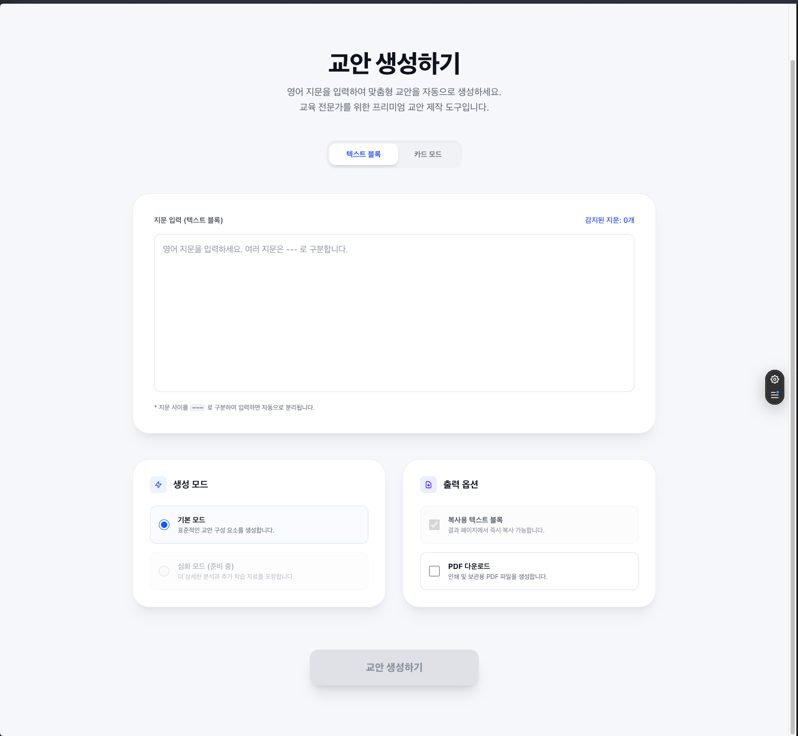
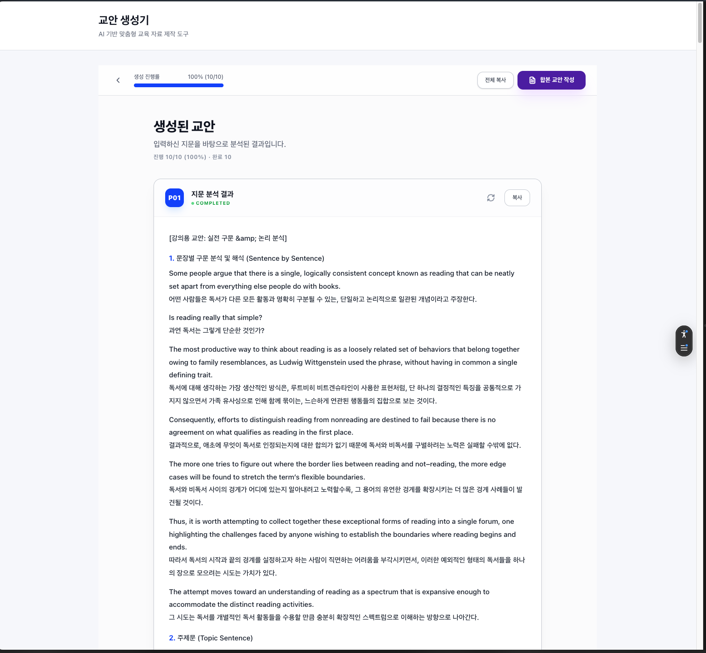
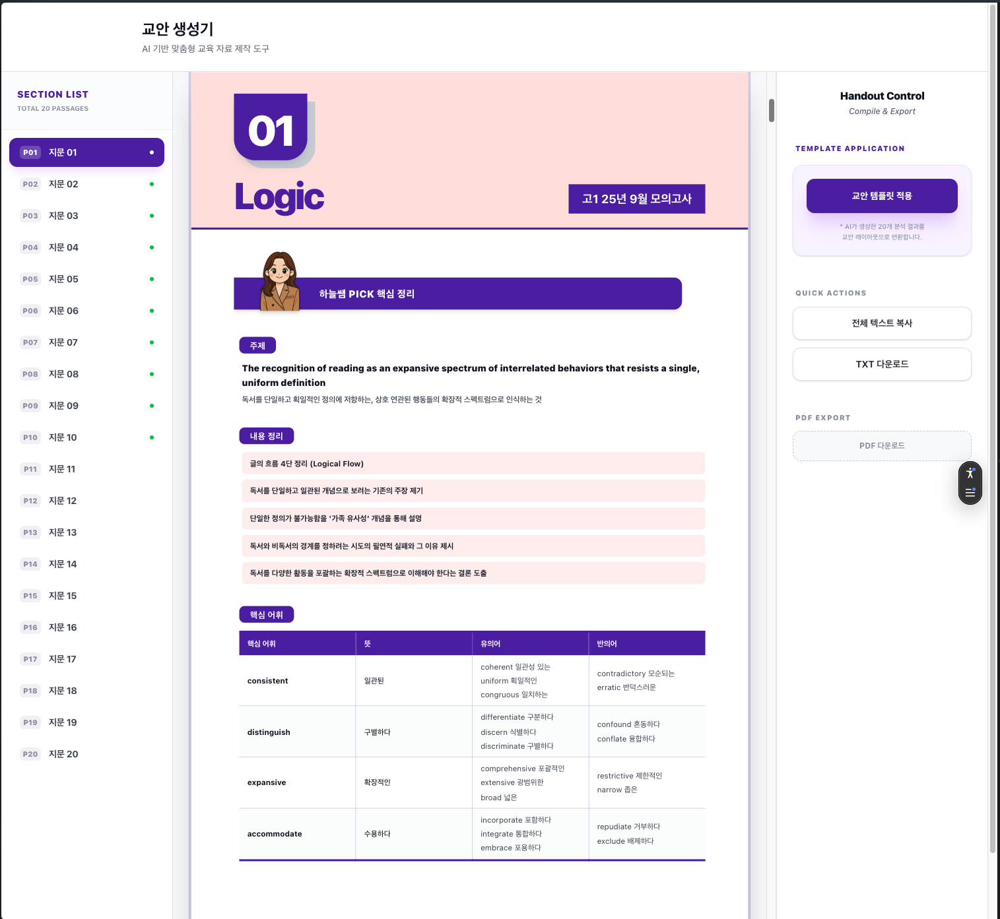
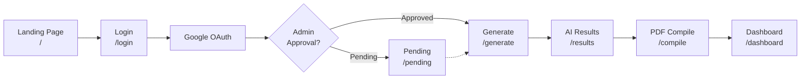

# GyoanMaker

_▶ [한국어 버전은 아래에 있습니다. (Korean version below)](#gyoanmaker-교안-메이커---한국어)_

An AI educational material compiler that analyzes English passages using **Google Gemini 2.5 Pro / Flash** and automatically generates a **high-quality, pixel-perfect printable UI** identical to real academy-distributed PDF handouts.

Users sign in via **Google OAuth** and must be **approved by an admin** before accessing the service. A public landing page introduces the service to all visitors.

**Live**: [https://gyoan-maker.store](https://gyoan-maker.store) (Cloudflare → Vercel)

## Why GyoanMaker?

### The Problem

Academy instructors spend **2–3 hours per passage** manually crafting handouts: sentence-by-sentence analysis, vocabulary tables with synonyms/antonyms, topic summaries, and pixel-perfect formatting — all before a single student walks through the door.

Multiply that by 5–10 passages per week, and handout preparation becomes the biggest time sink in an instructor's workflow.

### The Solution

GyoanMaker automates the entire pipeline. Paste a passage, click **Generate**, and receive a **print-ready PDF handout in under 30 seconds** — formatted exactly like a real academy-distributed document.

### What Makes It Different

| | Manual | GyoanMaker |
|---|---|---|
| **Time per passage** | 2–3 hours | ~30 seconds |
| **Sentence analysis** | Hand-typed | AI-generated (Gemini 2.5 Pro/Flash) |
| **Vocabulary table** | Copy-paste from dictionaries | Auto-extracted with CEFR-level synonyms/antonyms |
| **Summary & flow** | Written from scratch | AI-structured 4-step flow + bilingual summary |
| **PDF formatting** | Manual layout in Word/HWP | Pixel-perfect, auto-formatted, one-click export |
| **Customization** | Start over | Live editing with template settings |

## Screenshots

|          1. Landing Page           |       2. AI Analysis & Parsing        |         3. PDF Compile & Export         |
| :--------------------------------: | :-----------------------------------: | :-------------------------------------: |
|   |  |  |

## Key Features

### 1. Pixel-Perfect UI Rendering

- Perfectly matches the layout of the original lecture handout (65% English : 35% Korean ratio).
- Automatically publishes circular badges for numbers, avatar overlap designs, and a 4-column vocabulary table (Core Vocabulary | Meaning | Synonyms | Antonyms).
- Responsive 3-column layout (Nav / Canvas / Control Panel) using Tailwind CSS.
- **Template customization**: section-based font sizing, header/title text editing.

### 2. 2-Axis Generation Model

- **ContentLevel**: `advanced` (B2~C1) | `basic` (A2~B1) — controls vocabulary/summary complexity
- **ModelTier**: `pro` (Gemini 2.5 Pro) | `flash` (Gemini 2.5 Flash) — controls AI model quality/speed
- Each axis has its own system prompt for fine-tuned output quality.

### 3. Advanced Prompt Engineering

- Extracts high-difficulty vocabulary and diverse synonyms/antonyms at the **TEPS / CSAT (CEFR B2-C1)** level.
- Uses elegant paraphrasing and natural connectors, eliminating awkward literal Korean translations.

### 4. Strong Security Architecture (Cloudflare → Vercel Proxy → Cloud Run)

- **Cloudflare** WAF with country blocking (Korea-only access), DDoS protection, and DNS proxy.
- Next.js API Routes Proxy (`/api/generate`) prevents exposing the backend directly to the browser.
- Backend (Cloud Run) middleware layer issuing and authenticating `API_KEY` to completely block AI prompt injection and cost bombs.

### 5. Secret Manager-Based Prompt Management

- System prompts stored in **GCP Secret Manager** and mounted as volumes in Cloud Run.
- Real-time tracking of the prompt hash (SHA-256) and the model in use via the `/meta` endpoint.
- Local development uses file-based prompts (`server/system-prompt.txt`).

### 6. Client-Side PDF Generation & Inline Editing (No Backend Cost)

- Uses `html2canvas` and `jsPDF` to capture and render high-quality A4 PDF handouts entirely within the user's browser, eliminating expensive server-side rendering costs.
- Includes inline editing powered by `Zustand` to customize header text before exporting the PDF.
- Template settings panel for per-section font size control and custom header/title text.

### 7. Google OAuth & Admin Approval System

- **NextAuth.js v5** handles Google OAuth sign-in.
- **Firestore** stores user documents with `status: "pending" | "approved" | "rejected"`.
- **Edge middleware** enforces auth + role checks on protected routes.
- A public landing page (`/`) is accessible to all visitors without authentication.

### 8. Handout Management & Billing

- Save generated handouts to **Dashboard** (`/dashboard`) for later access.
- **Duplicate detection** via SHA-256 input hash prevents saving identical handouts.
- **4-tier billing system** (Free / Basic / Standard / Pro) with per-model monthly quotas.
- **Credits** system for pay-as-you-go usage after monthly quota exhaustion.
- **Account self-deletion** with cascading data cleanup.

## Getting Started (Local Execution)

Anyone can clone this repository, provide their **own Gemini API Key**, and instantly run the handout generator locally!

### Prerequisites

- Node.js 20.9+
- **pnpm 10.17+** (`corepack enable && corepack prepare pnpm@10.17.1 --activate`)
- **Google Gemini API Key** (or Google Cloud Vertex AI access)

### 1. Installation & Environment Setup

```bash
git clone <repository_url>
cd GyoanMaker
pnpm install

# Copy environment variables
cp .env.example .env.local
```

Open the `.env.local` file and set the following required variables:

**Backend auth — choose ONE mode:**

- **(A) API Key mode (simple, local dev):** Set `GOOGLE_API_KEY` to your Gemini API Key.
- **(B) Vertex AI ADC mode (same as production):** Set `GOOGLE_CLOUD_PROJECT` and run `gcloud auth application-default login`. `GOOGLE_API_KEY` is not required.

**Proxy auth (required for both modes):**

1. `API_KEY`: Any secret password to protect the local backend.
2. `CLOUDRUN_API_KEY`: The password the frontend uses to call the backend (must be identical to `API_KEY`).

### 2. Running the Dev Server

This is a **Turborepo monorepo** — a single command starts both servers in parallel:

```bash
pnpm dev
```

This runs:

- **Frontend** (Next.js): [http://localhost:3000](http://localhost:3000)
- **Backend** (Express): [http://localhost:4000](http://localhost:4000)

To run individual servers:

```bash
pnpm dev:web   # Frontend only
pnpm dev:api   # Backend only
```

### 3. Sample Local Test

Once the servers are running, visit the landing page and navigate to `/generate` (or click "Login" in the header to sign in first):

**Sample English Text:**

> Some people argue that there is a single, logically consistent concept known as reading that can be neatly set apart from everything else people do with books. Is reading really that simple? The most productive way to think about reading is as a loosely related set of behaviors that belong together owing to family resemblances, as Ludwig Wittgenstein used the phrase, without having in common a single defining trait.

1. Navigate to `/generate` and paste the text above into the text input area.
2. Click the **"Generate"** button.
3. The data is sent to the backend, and you can see the Gemini 2.5 Pro model rendering the data in a **perfect PDF handout layout** on the results page!

_(For advanced usage, architecture details, and Cloud Run deployment, please refer to the Korean documentation below or strictly use translation tools)._

---

# GyoanMaker (교안 메이커) - 한국어

Google Gemini 2.5 Pro / Flash를 활용하여 영어 지문을 분석하고, 실제 학원 배포용 **PDF 교안과 픽셀 레벨로 동일한 고품질 인쇄용 UI**를 자동 생성하는 AI 교육 자료 컴파일러입니다.

**Google OAuth**로 로그인하고, 관리자 승인을 받은 사용자만 서비스를 이용할 수 있습니다. 공개 랜딩 페이지에서 서비스 소개를 확인할 수 있습니다.

**운영 URL**: [https://gyoan-maker.store](https://gyoan-maker.store) (Cloudflare → Vercel)

## 왜 GyoanMaker인가?

### 문제

학원 강사는 지문 한 개당 **2~3시간**을 수작업으로 교안을 만드는 데 씁니다 — 문장별 분석, 유의어/반의어가 포함된 어휘 테이블, 토픽 요약, 그리고 픽셀 단위의 레이아웃 포맷팅까지. 수업 하나 시작하기도 전에 말입니다.

이걸 주당 5~10개 지문씩 반복하면, 교안 작성은 강사 업무에서 가장 큰 시간 소모 요인이 됩니다.

### 해결

GyoanMaker는 이 전체 파이프라인을 자동화합니다. 지문을 붙여넣고 **Generate** 버튼을 누르면, **30초 이내에 인쇄 가능한 PDF 교안**이 — 실제 학원 배포 문서와 동일한 포맷으로 완성됩니다.

### 차별점

| | 수작업 | GyoanMaker |
| --- | --- | --- |
| **지문당 소요 시간** | 2~3시간 | ~30초 |
| **구문 분석** | 직접 타이핑 | AI 자동 생성 (Gemini 2.5 Pro/Flash) |
| **어휘 테이블** | 사전에서 복사 붙여넣기 | CEFR 수준 유의어/반의어 자동 추출 |
| **요약 & 흐름** | 처음부터 작성 | AI 구조화 4단계 흐름 + 이중 언어 요약 |
| **PDF 포맷** | Word/한글에서 수동 레이아웃 | 자동 포맷, 원클릭 추출 |
| **커스터마이징** | 처음부터 다시 | 템플릿 설정으로 실시간 편집 |

## 스크린샷 (Screenshots)

|       1. 공개 랜딩 페이지          |         2. AI 지문 분석 결과          |         3. 최종 교안 PDF 컴파일         |
| :--------------------------------: | :-----------------------------------: | :-------------------------------------: |
|   |  |  |

## 사용 흐름



## 주요 기능 (Key Features)

### 1. 완벽한 PDF 렌더링 (Pixel-Perfect UI)

- 원본 강의용 교안의 레이아웃(영문 65% : 한글 35% 비율) 완벽 일치 반영.
- 01 숫자 둥근 뱃징, 아바타 오버랩 디자인, 4열 어휘 테이블(핵심어휘|뜻|유의어|반의어) 자동 퍼블리싱.
- Tailwind CSS를 활용한 반응형 3단 레이아웃(Nav / Canvas / Control Panel).

### 2. 2축 생성 모델

- **ContentLevel**: `advanced` (B2~C1) | `basic` (A2~B1) — 어휘/요약 난이도 조절
- **ModelTier**: `pro` (Gemini 2.5 Pro) | `flash` (Gemini 2.5 Flash) — AI 모델 품질/속도 선택
- 각 축별 전용 시스템 프롬프트로 최적화된 출력 품질.

### 3. 고도화된 프롬프트 엔지니어링

- **TEPS / 수능 (CEFR B2-C1)** 수준의 고난도 어휘 및 다채로운 유의어/반의어 추출.
- 한국어 직역의 어색함을 없앤 유려한 의역 및 부드러운 연결어 사용.

### 4. 강력한 보안 아키텍처 (Cloudflare → Vercel Proxy → Cloud Run)

- **Cloudflare** WAF 국가 차단(한국만 접근), DDoS 방어, DNS 프록시.
- 프론트엔드 브라우저 노출을 방지하는 Next.js API Routes Proxy (`/api/generate`).
- 백엔드(Cloud Run)의 `API_KEY` 발급 및 인증 미들웨어 레이어로 AI 비용 폭탄 원천 차단.

### 5. Secret Manager 기반 프롬프트 관리 시스템

- **GCP Secret Manager**에 시스템 프롬프트를 저장하고 Cloud Run 볼륨 마운트로 주입.
- `/meta` 엔드포인트를 통한 실시간 프롬프트 해시(SHA-256) 및 사용 모델 추적 가능.
- 로컬 개발 시에는 파일 기반 (`server/system-prompt.txt`) 사용.

### 6. 클라이언트 사이드 PDF 렌더링 & 인라인 에디팅 기능

- 별도의 비싼 PDF 렌더링 서버(Puppeteer 등) 없이 오직 유저의 브라우저 자원(`html2canvas`, `jspdf`)만으로 A4 고해상도 PDF 파일을 1초 안에 자동 병합 및 추출.
- `Zustand` 기반의 상태 관리를 통해 "고1 25년 9월" 등 실제 교안 배포에 필요한 커스텀 헤더 텍스트를 즉시 편집하고 PDF에 구워낼 수 있습니다.
- 템플릿 설정 패널: 섹션별 폰트 크기 조절, 커스텀 헤더/타이틀 텍스트 지원.

### 7. Google OAuth & 관리자 승인 시스템

- **NextAuth.js v5**를 통한 Google OAuth 로그인.
- **Firestore**에 사용자 문서 저장 (`status: "pending" | "approved" | "rejected"`).
- **Edge 미들웨어**가 보호된 경로에서 인증 + 역할 검사를 수행.
- 공개 랜딩 페이지(`/`)는 인증 없이 모든 방문자가 접근 가능.

### 8. 교안 관리 & 과금 시스템

- 생성된 교안을 **대시보드** (`/dashboard`)에 저장하여 나중에 다시 열기.
- SHA-256 입력 해시 기반 **중복 감지**로 동일 교안 재저장 방지.
- **4단계 요금제** (Free / Basic / Standard / Pro) 및 모델별 월간 쿼타.
- **크레딧** 시스템으로 월간 쿼타 소진 후 추가 사용 가능.
- **계정 자체 삭제** 기능 (교안 서브컬렉션 일괄 삭제 포함).

## 시작하기 (로컬 실행 방법)

누구나 이 저장소를 클론하여 **본인의 Gemini API Key**만 넣으면 즉시 로컬에서 교안 자동 생성기를 실행해볼 수 있습니다.

### 필수 요구사항

- Node.js 20.9 이상
- **pnpm 10.17+** (`corepack enable && corepack prepare pnpm@10.17.1 --activate`)
- **Google Gemini API Key** (또는 Google Cloud Vertex AI 권한)

### 1. 설치 및 환경 변수 세팅

```bash
git clone <저장소 주소>
cd GyoanMaker
pnpm install

# 환경변수 파일 복사
cp .env.example .env.local
```

`.env.local` 파일을 열어 아래와 같이 설정합니다.

**백엔드 인증 — 둘 중 하나 선택:**

- **(A) API Key 모드 (간단, 로컬 개발):** `GOOGLE_API_KEY`에 발급받은 Gemini API 키 입력.
- **(B) Vertex ADC 모드 (운영과 동일):** `GOOGLE_CLOUD_PROJECT` / `GOOGLE_CLOUD_LOCATION` 설정 후 `gcloud auth application-default login` 실행. `GOOGLE_API_KEY` 불필요.

**프록시 인증 (공통 필수):**

1. `API_KEY`: 로컬 백엔드 보호용 임의의 비밀번호
2. `CLOUDRUN_API_KEY`: 프론트가 백엔드 호출 시 사용할 비밀번호 (`API_KEY`와 같은 값)

### 2. 로컬 개발 서버 실행

이 프로젝트는 **Turborepo 모노레포**입니다. 한 명령어로 프론트엔드와 백엔드가 동시에 실행됩니다:

```bash
pnpm dev
```

실행되는 서버:

- **프론트엔드** (Next.js): [http://localhost:3000](http://localhost:3000)
- **백엔드** (Express): [http://localhost:4000](http://localhost:4000)

개별 서버 실행:

```bash
pnpm dev:web   # 프론트엔드만
pnpm dev:api   # 백엔드만
```

### 3. 로컬 테스트 해보기 (Sample Test)

서버가 실행되면 랜딩 페이지에서 로그인 후 `/generate`로 이동하여 아래 테스트용 영어 지문을 입력하고 퀄리티를 확인해 보세요.

**테스트용 영어 지문 예시:**

> Some people argue that there is a single, logically consistent concept known as reading that can be neatly set apart from everything else people do with books. Is reading really that simple? The most productive way to think about reading is as a loosely related set of behaviors that belong together owing to family resemblances, as Ludwig Wittgenstein used the phrase, without having in common a single defining trait.

1. 상단 헤더의 **Login** 버튼을 클릭하여 Google 계정으로 로그인합니다.
2. `/generate` 페이지에서 위 지문을 텍스트 입력 영역에 붙여넣습니다.
3. **Generate** 버튼을 클릭합니다.
4. 백엔드로 데이터가 전송되며, Gemini 2.5 Pro 모델이 **완벽한 PDF 교안 레이아웃**으로 데이터를 렌더링하여 결과 페이지에 표시됩니다!

## 프로젝트 구조

```text
gyoanmaker/                          # Turborepo monorepo (pnpm)
├── apps/
│   ├── web/                         # @gyoanmaker/web — Next.js 16 (Vercel)
│   │   ├── src/
│   │   │   ├── app/
│   │   │   │   ├── page.tsx              # 공개 랜딩 페이지
│   │   │   │   ├── opengraph-image.tsx   # 동적 OG 이미지 (Edge)
│   │   │   │   ├── generate/page.tsx     # 교안 생성 (레벨+모델 선택, 지문 입력)
│   │   │   │   ├── results/page.tsx      # AI 분석 결과
│   │   │   │   ├── compile/page.tsx      # PDF 편집 & 출력
│   │   │   │   ├── dashboard/page.tsx    # 저장된 교안 목록
│   │   │   │   ├── account/page.tsx      # 계정 관리 & 탈퇴
│   │   │   │   ├── pricing/page.tsx      # 요금제 안내
│   │   │   │   ├── privacy/page.tsx      # 개인정보 처리방침
│   │   │   │   ├── terms/page.tsx        # 서비스 이용약관
│   │   │   │   ├── (auth)/               # 인증 관련 (login, pending)
│   │   │   │   ├── admin/page.tsx        # 관리자 페이지
│   │   │   │   └── api/                  # API Routes (16개)
│   │   │   ├── components/               # UI 컴포넌트 (landing, compile, ui, layout 등)
│   │   │   ├── lib/                      # 유틸리티, Firestore CRUD
│   │   │   ├── stores/                   # Zustand 상태 관리
│   │   │   ├── services/                 # API 호출 서비스
│   │   │   ├── middleware.ts             # Edge 인증 + 역할 미들웨어
│   │   │   └── auth.ts / auth.config.ts  # NextAuth 설정
│   │   └── package.json
│   └── api/                         # @gyoanmaker/api — Express 5 (Cloud Run)
│       ├── src/
│       │   ├── server.ts                 # Express 엔트리포인트
│       │   ├── routes/                   # generate, meta 라우트
│       │   ├── services/                 # gemini, processor, prompt
│       │   ├── middleware/               # auth, rateLimit
│       │   └── validation/               # output, request, vocab
│       └── package.json
├── packages/
│   └── shared/                      # @gyoanmaker/shared — 공유 타입 & 요금제
│       └── src/
│           ├── plans/                    # 요금제 정의
│           ├── types/                    # 공유 타입
│           └── index.ts
├── server/                          # 검증 스크립트 & 로컬 프롬프트 파일
│   ├── scripts/                          # validate-output, validate-vocab-count
│   ├── validators/                       # 검증 로직
│   ├── system-prompt.txt                 # Advanced 모드 프롬프트 (로컬 dev)
│   └── system-prompt-basic.txt           # Basic 모드 프롬프트 (로컬 dev)
├── Dockerfile                       # Cloud Run 프로덕션 빌드 (multi-stage)
├── turbo.json                       # Turborepo 태스크 설정
├── pnpm-workspace.yaml              # 워크스페이스 정의
├── tsconfig.base.json               # 공통 TS 설정
└── .npmrc                           # pnpm 설정 (shamefully-hoist)
```

## 기술 스택

- **Monorepo**: Turborepo + pnpm 10.17 workspaces
- **Framework**: Next.js 16 (App Router)
- **Backend**: Express 5 (TypeScript)
- **Language**: TypeScript 5
- **UI Library**: React 19
- **Auth**: NextAuth.js v5 (Google OAuth) + Firestore (승인 관리)
- **State & Cache**: Zustand, TanStack Query (React Query)
- **AI**: Google Gemini 2.5 Pro / Flash (Vertex AI on Cloud Run, API Key locally)
- **Animation**: Framer Motion (scroll-triggered animations, carousel, layout transitions)
- **PDF Export**: html2canvas-pro, jsPDF
- **Styling**: Tailwind CSS 4
- **CDN/Security**: Cloudflare (WAF, DDoS, DNS proxy)
- **Deploy**: Vercel (frontend) + Google Cloud Run (backend via Cloud Build)
- **Secrets**: GCP Secret Manager (system prompts)
- **Database**: Firestore (users, handouts, usage\_logs)
- **Code Quality**: ESLint, Prettier

## 사용 가능한 스크립트

- `pnpm dev` - Turbo 병렬 개발 서버 (web + api)
- `pnpm dev:web` - 프론트엔드만 실행
- `pnpm dev:api` - 백엔드만 실행
- `pnpm build` - Turbo 프로덕션 빌드
- `pnpm type-check` - TypeScript 타입 검사 (전체)
- `pnpm lint` - ESLint 실행 (전체)
- `pnpm lint:fix` - ESLint 오류 자동 수정
- `pnpm format` - Prettier로 코드 포맷팅
- `pnpm format:check` - 코드 포맷 검사
- `node server/scripts/validate-output.js` - Topic/Summary 길이 규칙 검증
- `node server/scripts/validate-vocab-count.js` - Core Vocabulary 형식 검증

실제 `/generate` 응답(JSON 파일) 기준 검증도 가능합니다.

```bash
node server/scripts/validate-output.js /tmp/generate-output.json
```

Core Vocabulary 규칙(핵심어휘 4개 + 유의어/반의어 괄호 뜻 형식) 검증:

```bash
node server/scripts/validate-vocab-count.js handout.txt
node server/scripts/validate-vocab-count.js /tmp/generate-output.json
```

## 코드 품질

이 프로젝트는 코드 품질과 포맷팅을 위해 ESLint와 Prettier를 사용합니다.

### VS Code (권장)

VS Code를 사용하는 경우, 프로젝트에는 다음을 제공하는 권장 확장 프로그램과 설정이 포함되어 있습니다:

- 저장 시 자동 포맷팅
- 실시간 ESLint 오류 표시
- TypeScript IntelliSense 제공

### 수동 포맷팅

```bash
pnpm format        # 모든 파일 포맷팅
pnpm lint:fix      # 린트 오류 수정
```

## 환경 변수

| 변수                                      | 필수        | 설명                                         |
| ----------------------------------------- | ----------- | -------------------------------------------- |
| `API_KEY`                                 | ✅ (운영)   | 백엔드 보호용 키 (Cloud Run 설정)            |
| `ADMIN_KEY`                               | ✅ (운영)   | `/meta` 접근용 보안 키 (Cloud Run 설정)      |
| `API_KEYS`                                | 선택        | 다중 API 키 롤링용 목록(`,` 구분)            |
| `ADMIN_KEYS`                              | 선택        | 다중 Admin 키 롤링용 목록(`,` 구분)          |
| `CLOUDRUN_API_BASE_URL`                   | ✅ (Vercel) | Cloud Run 앱의 실제 URL (프록시용)           |
| `CLOUDRUN_API_KEY`                        | ✅ (Vercel) | 백엔드의 API\_KEY와 동일한 값                |
| `CLOUDRUN_API_TIMEOUT_MS`                 | 선택        | Proxy 타임아웃(ms), 미설정 시 기본 정책 사용 |
| `GOOGLE_CLIENT_ID`                        | ✅ (Vercel) | Google OAuth 클라이언트 ID                   |
| `GOOGLE_CLIENT_SECRET`                    | ✅ (Vercel) | Google OAuth 클라이언트 시크릿               |
| `NEXTAUTH_SECRET`                         | ✅ (Vercel) | NextAuth JWT 서명 키                         |
| `FIREBASE_PROJECT_ID`                     | ✅ (Vercel) | Firestore 프로젝트 ID                        |
| `FIREBASE_CLIENT_EMAIL`                   | ✅ (Vercel) | Firebase Admin 서비스 계정 이메일            |
| `FIREBASE_PRIVATE_KEY`                    | ✅ (Vercel) | Firebase Admin 비공개 키                     |
| `ADMIN_EMAILS`                            | ✅ (Vercel) | 관리자 이메일 목록(`,` 구분)                 |
| `CORS_ALLOW_ORIGINS`                      | ✅ (운영)   | 허용 Origin 목록(`,` 구분)                   |
| `PROXY_RATE_LIMIT_MAX`                    | 선택        | Proxy `/api/generate` 분당 허용량            |
| `PROXY_RATE_LIMIT_WINDOW_MS`              | 선택        | Proxy rate limit 윈도우(ms)                  |
| `GENERATE_RATE_LIMIT_MAX`                 | 선택        | 백엔드 `/generate` 윈도우당 허용량           |
| `GENERATE_RATE_LIMIT_WINDOW_MS`           | 선택        | 백엔드 `/generate` rate limit 윈도우(ms)     |
| `META_RATE_LIMIT_MAX`                     | 선택        | 백엔드 `/meta` 윈도우당 허용량               |
| `META_RATE_LIMIT_WINDOW_MS`               | 선택        | 백엔드 `/meta` rate limit 윈도우(ms)         |
| `GOOGLE_CLOUD_PROJECT`                    | ✅ (운영)   | GCP 프로젝트 ID                              |
| `GOOGLE_CLOUD_LOCATION`                   | ✅ (운영)   | GCP 리전 (예: `asia-northeast3`)             |
| `ENABLE_REPAIR`                           | 선택        | 규칙 위반 시 1회 자동 재시도 (기본: `true`)  |
| `REPAIR_MAX_ATTEMPTS`                     | 선택        | Repair 재시도 횟수 (기본: `1`, 최대 `1`)     |
| `PROCESSING_MODE`                         | —           | `sequential` (기본) 또는 `parallel`          |
| `NEXT_PUBLIC_INITIAL_GENERATE_CHUNK_SIZE` | 선택        | 결과 페이지 청크 단위(기본 2)                |
| `NEXT_PUBLIC_APP_URL`                     | ✅          | 앱의 공개 호스트 URL                         |
| `NEXTAUTH_URL`                            | ✅ (Vercel) | 운영 URL (`https://gyoan-maker.store`)       |
| `NEXT_PUBLIC_ADMIN_EMAILS`                | 선택        | 클라이언트 사이드 관리자 UI 표시용           |

### 우선순위

- **인증 방식**: `GOOGLE_CLOUD_PROJECT` 있으면 → Vertex AI ADC 모드 (Cloud Run 운영 권장) → 없으면 `GOOGLE_CLOUD_API_KEY` → `GOOGLE_API_KEY` (로컬 개발 fallback)
- **시스템 프롬프트**: GCP Secret Manager 볼륨 마운트 (프로덕션) → 로컬 파일 `server/system-prompt.txt` (개발)

## 보안 아키텍처 (Cloudflare → Vercel API Proxy → Cloud Run)

비용 방어와 키 노출 방지를 위해 다음과 같은 구조를 사용합니다.

1. **Cloudflare**: DNS 프록시 + WAF 국가 차단 (한국만 허용) + DDoS 방어.
2. **브라우저**: `/api/generate` (Vercel 내장 주소)를 호출합니다.
3. **Vercel Server Side**: `CLOUDRUN_API_KEY`를 헤더에 붙여 Cloud Run에 요청을 전달(Proxy)합니다.
4. **Cloud Run**: `X-API-KEY`를 검증하여 일치할 때만 인스턴스를 실행합니다.

이 방식을 통해 브라우저 Network 탭에서 Cloud Run의 주소와 API Key가 일절 노출되지 않습니다.

### 운영 보안 정책 (권장)

1. **CORS Allowlist 강제**: `CORS_ALLOW_ORIGINS`에 허용 도메인만 명시하세요. `*`는 운영에서 금지합니다.
2. **키 롤링**: `API_KEYS`, `ADMIN_KEYS`를 사용해 신/구 키를 동시에 허용한 뒤 점진 교체하세요.
3. **로그 마스킹**: 키/토큰 원문을 절대 로그에 남기지 않고, `X-Request-ID` 기반으로 추적하세요.
4. **이중 Rate Limit**: Proxy와 Backend 둘 다 rate limit을 켜서 과도 호출을 차단하세요.

### Timeout 정책

- 기본값은 Proxy 기준 120초이며(`CLOUDRUN_API_TIMEOUT_MS` 미설정 시), 로컬 타겟(`localhost/127.0.0.1`)은 개발 편의를 위해 10분 timeout을 사용합니다.
- 운영 환경에서는 `CLOUDRUN_API_TIMEOUT_MS`를 명시해 환경별 편차를 제거하는 것을 권장합니다.

## 서버 메타데이터 확인 (/meta)

서버의 현재 상태와 어떤 프롬프트를 사용 중인지 확인하려면 `/meta` 엔드포인트를 호출하세요. 보안을 위해 `X-ADMIN-KEY` 헤더가 필요합니다.

```bash
curl -H "X-ADMIN-KEY: YOUR_ADMIN_KEY" https://your-api-url/meta
```

반환값 예시:

```json
{
  "model": "gemini-2.5-pro",
  "location": "asia-northeast3",
  "promptSource": "file",
  "promptSha256": "84a3b8...",
  "promptHead": "# Role 당신은 대한민국 대치동 1타..."
}
```

## Cloud Run 배포

### 자동 배포 (Cloud Build)

`main` 브랜치에 push하면 **Cloud Build**가 자동으로 트리거되어 배포됩니다.

- 루트 `Dockerfile`을 사용한 multi-stage 빌드
- 시스템 프롬프트는 **GCP Secret Manager** 볼륨 마운트로 주입
- 포트: 8080

### 수동 배포

```bash
gcloud run deploy your-api-service-name \
  --source . \
  --region asia-northeast3 \
  --platform managed \
  --allow-unauthenticated \
  --set-env-vars "GOOGLE_CLOUD_PROJECT=your-project-id" \
  --set-env-vars "GOOGLE_CLOUD_LOCATION=asia-northeast3" \
  --set-env-vars "API_KEY=your-secure-api-key" \
  --set-env-vars "ADMIN_KEY=your-secure-admin-key"
```

> **운영 환경에서 `GOOGLE_API_KEY`는 설정하지 않는 것을 권장합니다.** `GOOGLE_CLOUD_PROJECT`가 있으면 Vertex AI ADC(서비스 계정) 방식으로 자동 인증됩니다.

### 서비스 계정 권한

```bash
gcloud projects add-iam-policy-binding your-project-id \
  --member="serviceAccount:YOUR_PROJECT_NUMBER-compute@developer.gserviceaccount.com" \
  --role="roles/aiplatform.user"
```

### 배포 확인

```bash
curl "${CLOUDRUN_API_BASE_URL}/health"
# {"ok":true}
```
